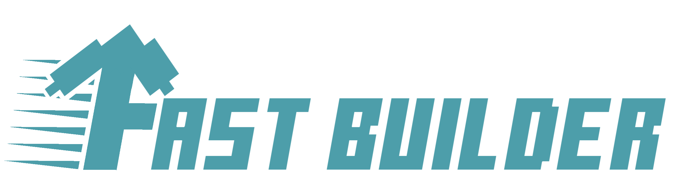

# FastBuilder


Websocket based Minecraft Bedrock Structure Generator. 
Currently a port of [Voxel Geometry](https://github.com/CAIMEOX/VoxelGeometry.git) in WebSocket.

## Run the server
Install the dependencies by `pnpm i` and then execute the server by:
```bash
npm run start
```

## Maintainer
* [**CAIMEO**](https://github.com/CAIMEOX)